# iwent — веб-версия

Сервис, в котором люди договариваются о встречах: кто-то создаёт событие
(«идём в кино в четверг», «волейбол во дворе»), остальные видят его в ленте,
отправляют заявку и после встречи складывают общие фотографии в одно место.

Учебный проект курса НИУ ВШЭ «Веб-программирование», 2026.
Автор: Варвара Малинина.

Тема взята из моего же приложения iwent — оно опубликовано в App Store, но там
нативный клиент. В рамках курса я собираю **веб-версию с нуля**: от статичной
вёрстки до React-приложения со своим бэкендом.

---

## Экраны

Шесть связанных экранов, переходы между которыми образуют один сценарий:
нашёл событие → открыл → подал заявку → создал своё → ответил на заявки →
посмотрел, что получилось, в профиле.

| # | Экран | Что на нём происходит |
|---|---|---|
| 1 | **Лента событий** | Карточки событий, поиск, фильтры по дате, городу, тегам и ограничениям. Переключение «все события / только друзья». |
| 2 | **Событие** | Обложка, описание, дата и место, участники, кнопка «пойду». Для автора — управление заявками. |
| 3 | **Создание события** | Многошаговая форма: название и описание, дата и время, место, обложка, приватность, кого позвать, ограничения по возрасту и полу. |
| 4 | **Мои события** | Свои и чужие события, разложенные по статусам: предстоящие, прошедшие, заявки на рассмотрении. Папки для сохранённых. |
| 5 | **Входящие** | Заявки на участие (принять / отклонить) и переписка по каждому событию. |
| 6 | **Профиль** | Данные о себе, организованные и посещённые события, «воспоминания» — фотографии с прошедших встреч, настройки. |

## Интерактивность

Интерфейс не просто реагирует, но и **запоминает состояние**: сначала в
`localStorage`, позже — на сервере.

- фильтры и поиск в ленте сохраняются между заходами;
- форма создания события хранит черновик: закрыл вкладку на третьем шаге —
  вернулся и продолжил с того же места;
- валидация полей формы прямо по ходу ввода, а не только при отправке;
- «сохранить событие» и папки — список остаётся после перезагрузки;
- заявки меняют статус и остаются в этом статусе;
- тема и язык интерфейса — выбор пользователя, тоже запоминается.

## Оформление

- Тёмная тема как основная: фон `#0A0A0C`, поверхности `#141417` и `#1C1C20`,
  текст `#F4F4F5`, акцент — оранжевый `#FF8D32`.
- Статусные цвета: `#34C759` успех, `#FF3B30` ошибка, `#EF9F27` предупреждение.
- Единая сетка отступов, одинаковые радиусы скругления у карточек и кнопок,
  один набор иконок, один шрифт с несколькими начертаниями.
- Логотип — фигурка с поднятыми руками, она же иконка приложения.

## Адаптивность

Вёрстка mobile-first. До 768 px — одна колонка и нижняя панель навигации,
как в мобильном приложении. Шире 768 px — боковое меню слева, контент по
центру, вспомогательные блоки справа. Проверяется на ширинах 360, 768 и 1440 px.

## Состояния элементов

У всех кликабельных элементов — карточек, кнопок, полей ввода, ссылок и
пунктов меню — описаны состояния `:hover`, `:focus-visible`, `:active` и
`:disabled`. Фокус виден при навигации с клавиатуры, а не убран через
`outline: none`.

---

## Как это выглядит

Скриншоты сняты с работающей веб-версии, в двух ширинах: десктоп 1440 px и
телефон 390 px.

### Лента событий

Слева боковое меню, по центру лента, справа сообщения и быстрые действия.
На телефоне колонка одна, навигация уезжает вниз.

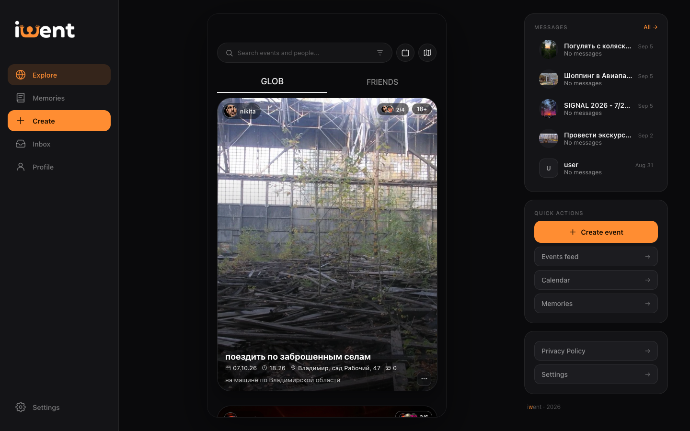

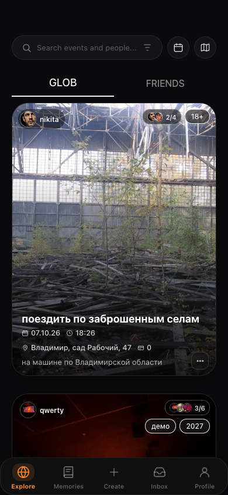

### Событие

Обложка, место, описание и общий альбом участников.

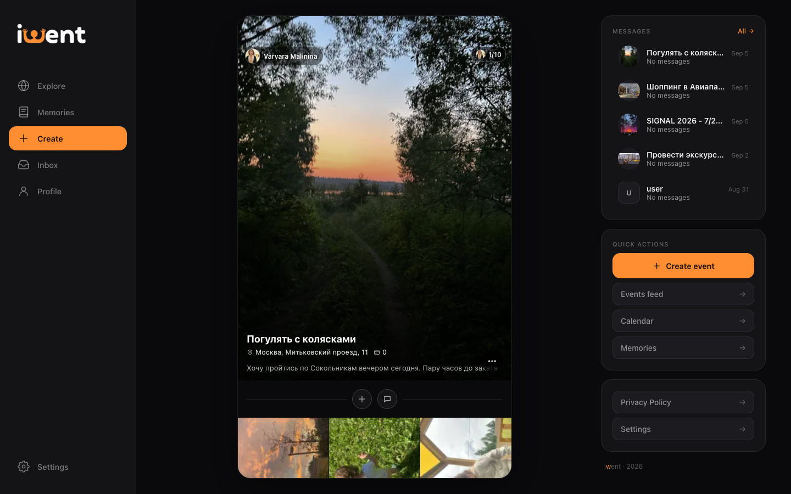

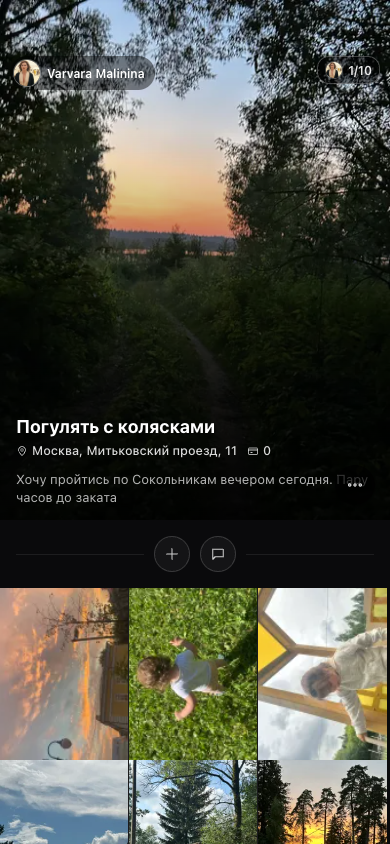

### Создание события

Форма из трёх шагов: основное, участники, предпросмотр. Счётчики символов,
обязательные поля, выбор даты и времени.

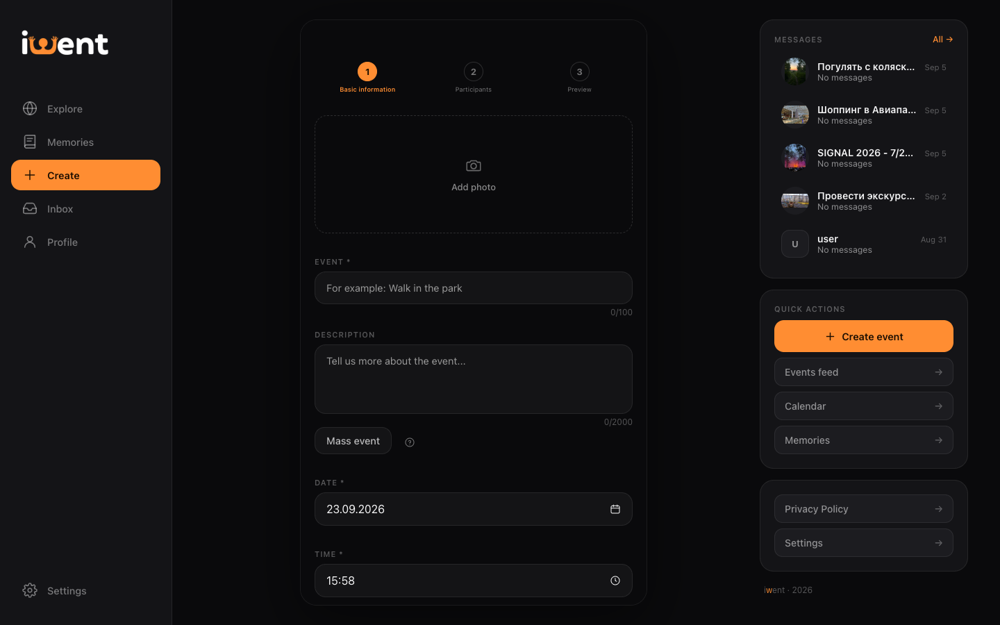

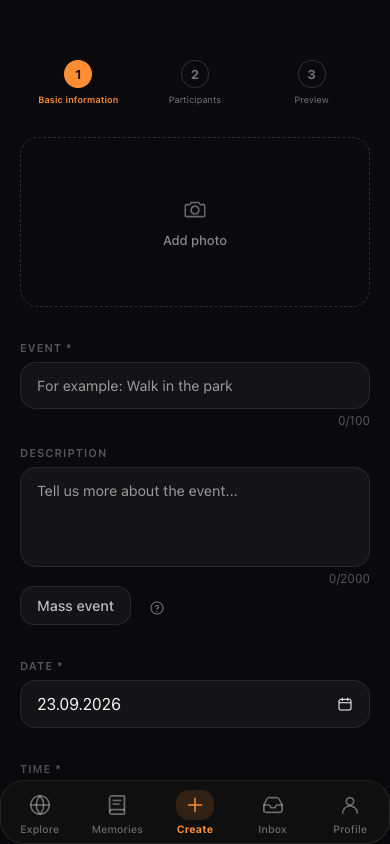

### Профиль

Аватар, счётчики событий и друзей, организованные и посещённые события, а ниже
— воспоминания и папки, в которые сложены прошедшие встречи.

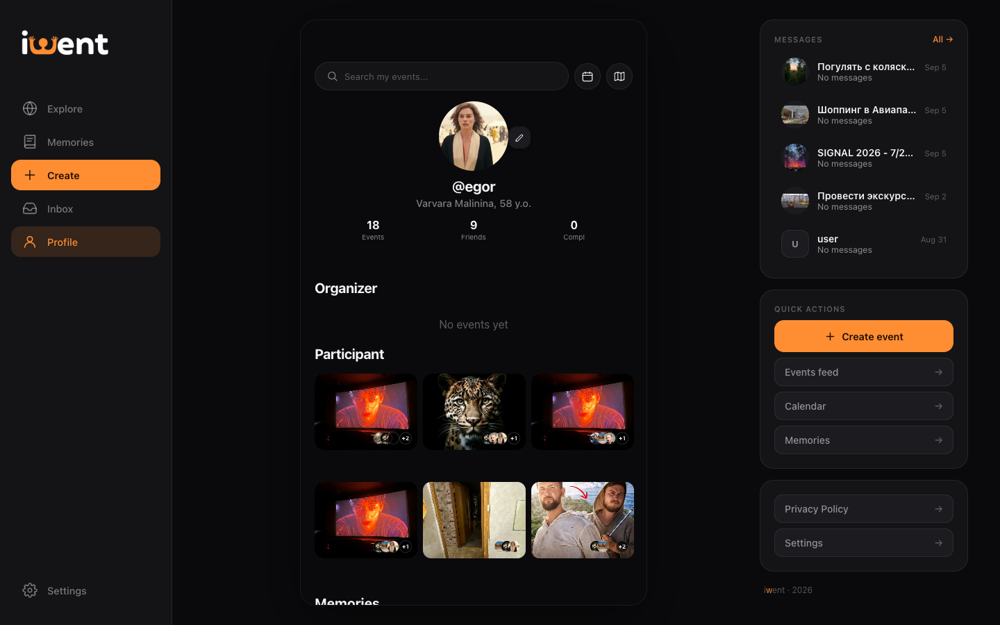

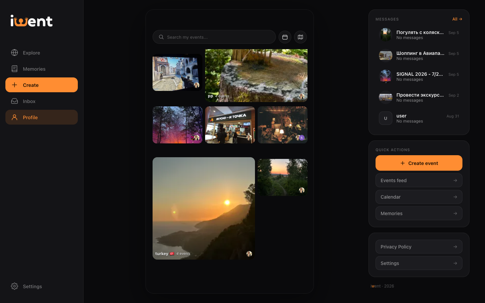

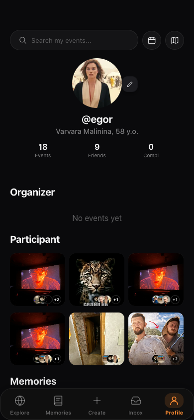

### Воспоминания

Общая лента фотографий с прошедших событий: автор, дата, лайки и комментарии.

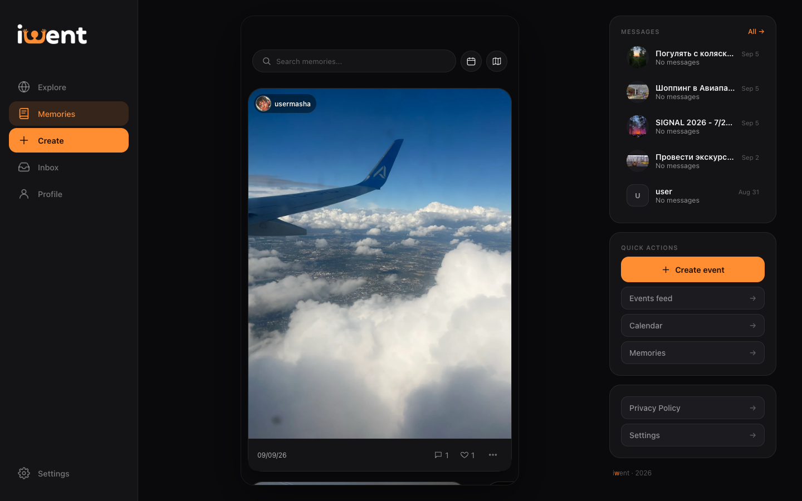

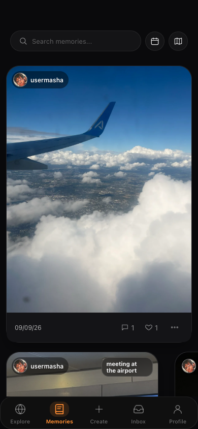

### Календарь

События месяца с обложками прямо в сетке дней.

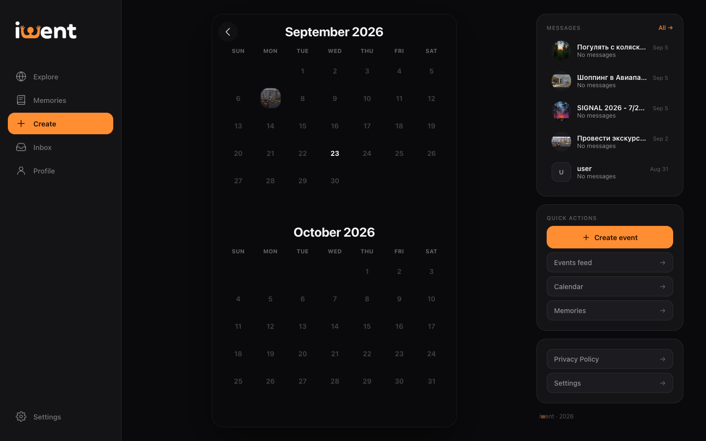

## Структура репозитория

```
main                 описание проекта (этот файл) и скриншоты в docs/screens
hw-1-html-css …      по ветке на каждое из семи заданий
certificates         сертификаты пройденных курсов
```

Ветки не наследуют друг друга: каждая начинается от `main`, чтобы проверять
их можно было независимо.
